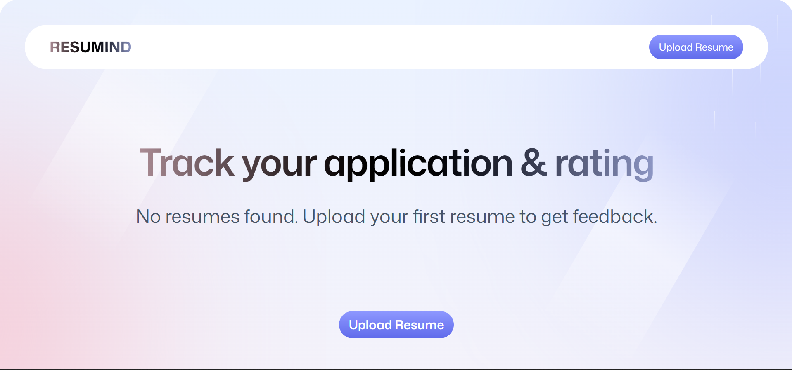

# Resumind - AI Resume Analyzer



A modern, production-ready AI-powered resume analyzer built with React Router and Puter.js. Resumind helps users optimize their resumes for ATS (Applicant Tracking Systems) and provides detailed feedback using Claude 3.7 Sonnet.

## 🚀 Features

- **AI Analysis**: Powered by Claude 3.7 Sonnet via Puter AI.
- **ATS Scoring**: Detailed ATS compatibility score and suggestions.
- **Visual Feedback**: Real-time resume scanning animation and visual score badges.
- **Cloud Storage**: Seamless integration with Puter.js for file and data storage.
- **Modern Stack**: Built with React Router v7, Tailwind CSS v4, and TypeScript.
- **Server-Side Rendering**: Optimized performance and SEO.
- **Responsive Design**: Works perfectly across all device sizes.

## 🛠️ Tech Stack

- **Framework**: [React Router v7](https://reactrouter.com/)
- **UI & Styling**: [Tailwind CSS v4](https://tailwindcss.com/), [Zustand](https://zustand.docs.pmnd.rs/), [Framer Motion](https://www.framer.com/motion/) (via tw-animate-css)
- **Backend/AI Services**: [Puter.js](https://puter.com/) (Auth, FS, KV, AI)
- **PDF Processing**: [pdf.js](https://mozilla.github.io/pdf.js/)
- **Build Tool**: [Vite](https://vitejs.dev/)

## 📋 Requirements

- Node.js 20 or higher
- npm (or pnpm/yarn)
- A Puter.com account (for production storage and AI features)

## 🏁 Getting Started

### 1. Installation

Install the dependencies:

```bash
npm install
```

### 2. Development

Start the development server with HMR:

```bash
npm run dev
```

Your application will be available at `http://localhost:5173`.

### 3. Production Build

Create a production build:

```bash
npm run build
```

To start the production server:

```bash
npm start
```

## 🐳 Docker Deployment

To build and run using Docker:

```bash
docker build -t ai-resume-analyzer .

# Run the container
docker run -p 3000:3000 ai-resume-analyzer
```

## 📜 Available Scripts

- `npm run dev`: Start development server.
- `npm run build`: Build the application for production.
- `npm run start`: Start the production server.
- `npm run typecheck`: Run TypeScript type checking.

## 📁 Project Structure

```text
├── app/
│   ├── components/       # Reusable UI components (ATS, Summary, etc.)
│   ├── lib/              # Puter.js initialization and utility functions
│   ├── routes/           # Application pages and route handlers
│   ├── root.tsx          # Main layout and Puter.js initialization
│   ├── routes.ts         # Route definitions
│   └── app.css           # Global styles and Tailwind configuration
├── public/               # Static assets (images, icons, workers)
├── constants/            # Project-wide constants
├── types/                # TypeScript type definitions
├── react-router.config.ts # React Router configuration
└── vite.config.ts        # Vite configuration
```

## 🔐 Environment Variables

TODO: List any required environment variables here.
Currently, the project relies on Puter.js's global script for authentication and services.

## ⚖️ License

TODO: Add license information (e.g., MIT, Apache 2.0).

---

Built with ❤️ using React Router and Puter.js.
